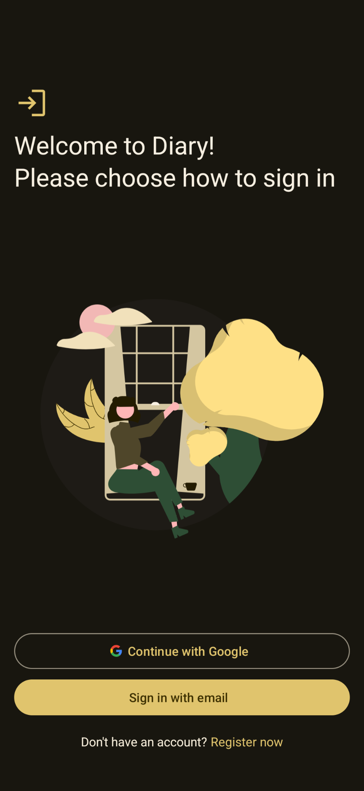
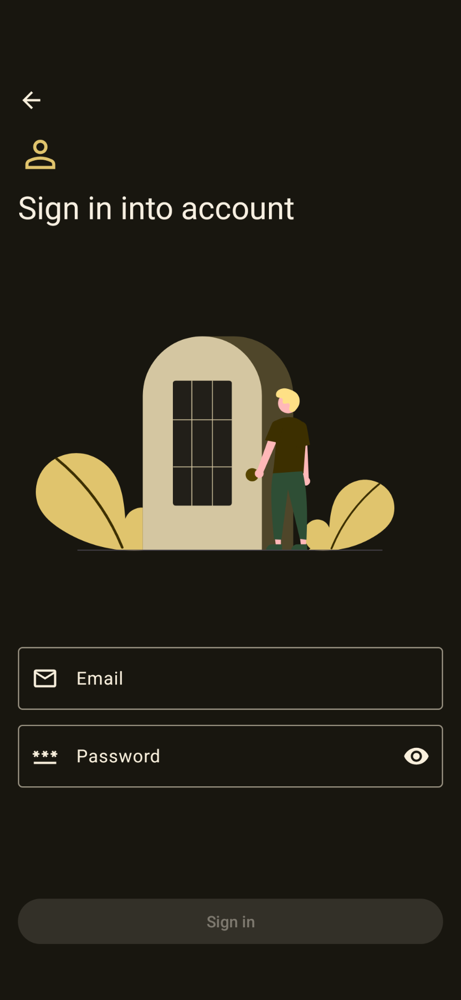
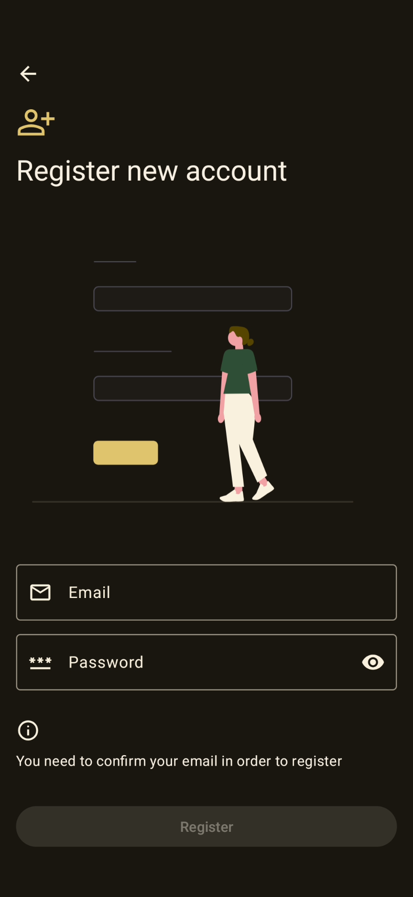
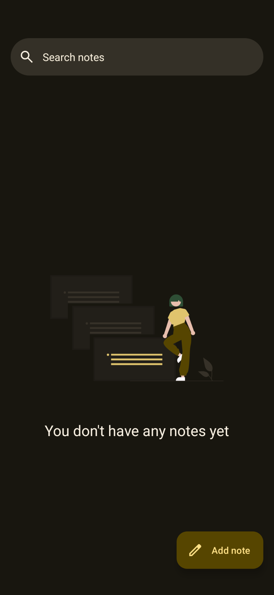
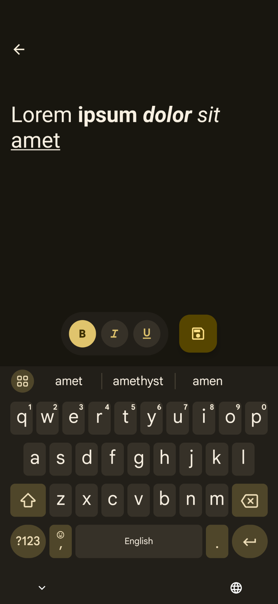
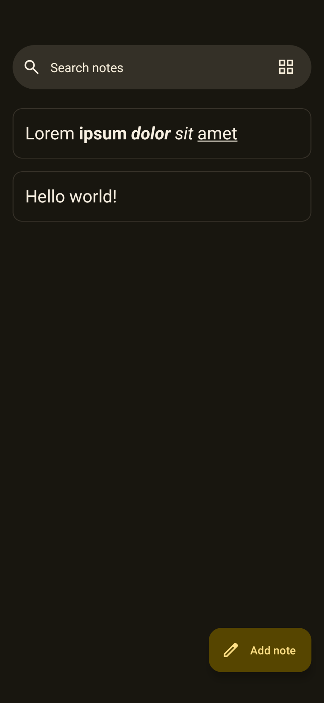

# 📖 Diary  

**Diary** is a simple and elegant mobile application built in **Kotlin** with **Material 3 Design**. It features a **rich text editor** that allows users to format text with bold, italic, and underlined styles, making it perfect for journaling or documenting thoughts and ideas. This app is being developed as part of a **college project**.  

## ✨ Key features  
- **Rich text editor**:  
  Add bold, italic, and underlined text to your entries 

- **Material 3 design**:  
  Sleek and modern UI with support for light and dark modes

- **Firebase integration**:  
  Firebase realtime database for storing and managing diary entries in the cloud securely

## 🎨 Screenshots  
|  |  | 
|---                                                     |---                                                     |---   
|  |  |              
  

## 📲 Installation  
1. Clone this repository:
   ```bash
    git clone https://github.com/HotarunIchijou/Diary.git
   ```
3. Open the project in **Android Studio**
4. Sync Gradle files and resolve dependencies  
5. Run the project on an emulator or a physical device 

## 🛠️ Tech Stack  
- **Programming language**: Kotlin  
- **Design framework**: Material Design 3
- **Database**: Firebase Realtime Database 

## 🚀 Usage  
1. Open the app and register or log in into existing account
2. Create a new diary entry
3. Use the rich-text editor to style your content 
4. Save your work (auto-save coming soon!)  

## 📝 TODO List  
Here's what's planned for future updates:  
- [x] Add **auto-save** functionality
- [x] Rewrite some activities to fragments
- [x] Implement tasks in addition to notes
- [ ] Support for **image uploads** in entries
- [ ] Add settings
- [ ] Add themes

## 🤝 Contribution  
Contributions are welcome!  
1. Fork the repository  
2. Create a new branch with your feature or fix  
3. Commit and push your changes  
4. Open a pull request for review  

## ⚖️ License  
This project is licensed under the [MIT License](https://github.com/HotarunIchijou/Diary/blob/master/LICENSE)

## 📧 Contact  
Feel free to reach out with questions or suggestions:  
- **Email**: hotarunichijou@ik.me
- **Telegram**: [@KaorunIchijou](https://t.me/KaorunIchijou)

## 🙌 Special thanks to:  
- [Shemmy](https://github.com/N3Shemmy3) and [Nick](https://github.com/nift4) for their invaluable support throughout the entire development process
- [Nathan](https://github.com/imnathanzero) for testing the application
- 1gravity for creating native [rich text library](https://github.com/1gravity/Android-RTEditor)
